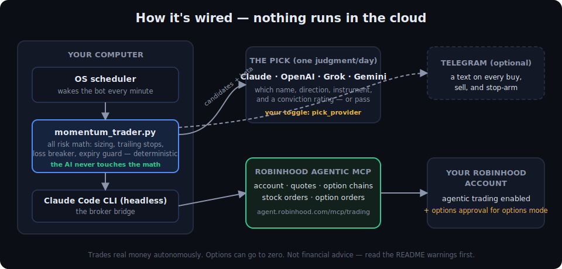
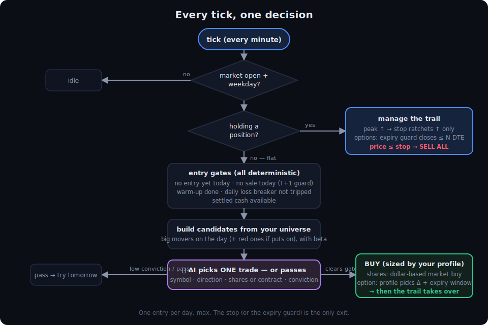

# 🤖 AI Momentum Trader — Stocks & Options on Robinhood, hands off

One AI-picked momentum trade a day. **Stocks, options, or both.** You pick the risk with one word, pick the asset mode with one word, and pick the AI brain (Claude, OpenAI, Grok, or Gemini) with one word. Everything that touches your money — sizing, stops, the daily loss breaker, the options expiry guard — is plain, deterministic Python you can read. The AI only decides *what* to buy.

🎛️ **Don't want to edit code by hand?** Use the **[interactive Config Builder](https://merjua14.github.io/ai-momentum-trader/)** — flip the toggles, copy your generated config, paste it in. (Enable GitHub Pages on this repo and it's a live webpage.)



---

## ⚠️ READ THIS FIRST — the honest version

This is an experiment, not a money machine.

- It trades **real money** with **no approval prompts** (`--dangerously-skip-permissions` on purpose, so it can run unattended).
- **Options can go to ZERO.** A long call or put is defined-risk, but "defined" includes losing 100% of the premium. Fast.
- On the `degen` profile it puts your **whole balance behind ONE idea**.
- It **holds overnight**. Gaps and after-hours news can blow through any stop.
- Robinhood requires **options approval** on your account before options mode will work at all.
- The code is **unaudited**, and the AI **can be wrong**.

**Not financial advice. No warranty. Use money you can fully afford to lose, and start with a tiny balance until you trust it.**

---

## How it's wired

Your computer wakes the bot every minute. It reads your account, quotes, and option chains through the Robinhood agentic MCP, asks your chosen AI for one pick (name + direction + instrument + conviction), does its own risk math, places the order, and (optionally) pings you on Telegram. Nothing runs in the cloud.



---

## 🎛️ The three toggles

### Toggle 1 — Risk profile (one word)

```python
ACTIVE_PROFILE = "normal"   # "conservative" | "normal" | "degen" | "custom"
```

| Profile | Bet size | Picky? | Stock stop | Option stop | Option style |
|---|---|---|---|---|---|
| **conservative** | 25% of cash | strong movers, high conviction only | 1% stop, trails 0.5% | −15% premium, trails 10% | deep ITM (Δ0.60), 21–45 DTE |
| **normal** | 50% of cash | high conviction only | 1.5% stop, trails 1% | −25% premium, trails 15% | ATM (Δ0.50), 14–30 DTE |
| **degen** | 100% — full port | takes medium conviction, jumps in early | 3% stop, trails 2% | −40% premium, trails 25% | OTM (Δ0.40), 7–21 DTE |

### Toggle 2 — Asset mode (one word)

```python
"asset_mode": "stocks",   # "stocks" | "options" | "both"
```

- `"stocks"` — shares only. The classic bot.
- `"options"` — single-leg long calls (long puts too if you flip `allow_puts` on).
- `"both"` — the AI chooses shares vs. a contract per pick; falls back to shares if a contract doesn't fit the budget.

### Toggle 3 — AI brain (one word)

```python
"pick_provider": "claude",   # "claude" | "openai" | "grok" | "gemini"
```

Claude is the default: no API key, and it can web-search fresh catalysts. The other three need their API key set as an environment variable. **Order execution always runs through the Robinhood MCP via Claude Code no matter which brain you pick.**

---

## What you need

1. A computer that stays **on and awake** during market hours (Windows / macOS / Linux).
2. **Python 3.9+** (`python --version`).
3. **Claude Code CLI**, logged in — this is the broker bridge.
4. A **Robinhood account with agentic trading enabled** (and **options approval** if you want options mode).
5. Optional: an OpenAI / xAI / Gemini API key, only if you want that brain to pick.
6. Optional: a **Telegram bot** for a text on every buy and sell.

---

## Setup, step by step

<details>
<summary><b>Step 1 — Get Python</b> (click to expand)</summary>

- **Windows:** install from [python.org](https://www.python.org/downloads/). On the first installer screen tick **"Add python.exe to PATH."** Then open a NEW terminal:
  ```
  python --version
  ```
- **macOS:** `brew install python` or python.org.
- **Linux:** almost certainly installed. `python3 --version`.

You want 3.9 or newer.
</details>

<details>
<summary><b>Step 2 — Install the Claude Code CLI and log in</b></summary>

Follow Anthropic's current install guide for [Claude Code](https://docs.claude.com/en/docs/claude-code), then:

```
claude --version     # prints a version = installed
claude               # run once, log in, then /exit
claude -p "say hi"   # headless works = you're good
```

If `claude -p` says **"Invalid API key"**, you have a stale `ANTHROPIC_API_KEY` environment variable overriding your login. Delete it, open a new terminal, log in with plain `claude`.
</details>

<details>
<summary><b>Step 3 — Add the Robinhood MCP and authorize it (one time)</b></summary>

```
claude mcp add -s user --transport sse robinhood https://agent.robinhood.com/mcp/trading
```

If it later shows "Failed to connect," it's usually the transport. Remove and re-add with the other one:

```
claude mcp remove -s user robinhood
claude mcp add -s user --transport http robinhood https://agent.robinhood.com/mcp/trading
```

Then open interactive `claude`, run `/mcp`, select **robinhood**, and finish the login in your browser. Confirm:

```
claude mcp list      # robinhood should show connected
```
</details>

<details>
<summary><b>Step 4 — Prove it can reach your account (read-only, no orders)</b></summary>

```
claude -p "Call get_accounts and return only JSON listing each account_number and its agentic_allowed flag." --allowedTools "mcp__robinhood__get_accounts" --dangerously-skip-permissions
```

Write down the **account number** that shows `agentic_allowed: true`. That's the account the bot trades. If this returns your account, the whole pipeline works.

**Options mode only:** your Robinhood account also needs options trading approval (Robinhood app → account settings → options). Without it, options orders will simply fail.
</details>

<details>
<summary><b>Step 5 — Download this repo</b></summary>

Green **Code** button → **Download ZIP** → unzip. Or:

```
git clone https://github.com/merjua14/ai-momentum-trader.git
cd ai-momentum-trader
python -m pip install -r requirements.txt
```

(The only dependency is `tzdata`, and only Windows actually needs it.)
</details>

<details>
<summary><b>Step 6 — Configure it (or use the Config Builder)</b></summary>

Easiest path: open the **[Config Builder](https://merjua14.github.io/ai-momentum-trader/)**, flip your toggles, hit copy, and paste the generated block over the top of `momentum_trader.py`.

By hand, set at the top of `momentum_trader.py`:

- `ACTIVE_PROFILE` — `"conservative"`, `"normal"`, `"degen"`, or `"custom"`.
- `CONFIG["account_number"]` — the agentic account number from Step 4.
- `CONFIG["asset_mode"]` — `"stocks"`, `"options"`, or `"both"`.
- `CONFIG["allow_puts"]` — `True` if you want bearish trades via long puts.
- `CONFIG["pick_provider"]` — which AI picks.
- `CONFIG["universe"]` — the tickers it may choose from. **Keep them liquid**; wide option spreads eat you alive in options mode.
- `CONFIG["extra_pick_guidance"]` — your own standing instructions to the AI, e.g. `"Only large caps. Avoid earnings weeks. Favor AI and energy."`
</details>

<details>
<summary><b>Step 7 — Optional: a different AI brain (OpenAI / Grok / Gemini)</b></summary>

1. Get the key: [platform.openai.com](https://platform.openai.com) / [console.x.ai](https://console.x.ai) / [aistudio.google.com](https://aistudio.google.com).
2. Set it as an environment variable:

```
# Windows (PowerShell), then open a NEW terminal
setx OPENAI_API_KEY "your_key_here"        # or XAI_API_KEY / GEMINI_API_KEY

# macOS / Linux — add to ~/.zshrc or ~/.bashrc
export OPENAI_API_KEY="your_key_here"
```

3. Set `pick_provider` and the matching model name in `CONFIG`. Model names change over time — if a provider rejects the string, set whatever your account currently lists.
</details>

<details>
<summary><b>Step 8 — Optional: Telegram alerts on every buy/sell</b></summary>

1. Message **@BotFather** on Telegram → `/newbot` → copy the token.
2. Message your new bot once (it can't text you first).
3. Open `https://api.telegram.org/bot<YOUR_TOKEN>/getUpdates` and find the numeric `"id"` under `"chat"`.
4. Set `TELEGRAM_BOT_TOKEN` and `TELEGRAM_CHAT_ID` as environment variables (same pattern as Step 7).
</details>

<details>
<summary><b>Step 9 — Test one tick by hand, during market hours</b></summary>

```
python momentum_trader.py --once
```

Outside market hours it prints "Outside the session. Idle." — that's correct. During the session it warms up, scores the universe, runs the pick, and either enters or passes. **Start with a tiny balance and watch a full trade go through before you automate anything.**
</details>

<details>
<summary><b>Step 10 — Make it run itself</b></summary>

**Windows (Task Scheduler via PowerShell):**

```powershell
$py  = (python -c "import sys; print(sys.executable)")
$dir = "C:\path\to\ai-momentum-trader"

$action  = New-ScheduledTaskAction -Execute $py -Argument "momentum_trader.py --once" -WorkingDirectory $dir
$trigger = New-ScheduledTaskTrigger -Daily -At 9:00am
$trigger.Repetition = (New-ScheduledTaskTrigger -Once -At 9:00am `
    -RepetitionInterval (New-TimeSpan -Minutes 1) `
    -RepetitionDuration (New-TimeSpan -Hours 8)).Repetition
$settings = New-ScheduledTaskSettingsSet -StartWhenAvailable `
    -AllowStartIfOnBatteries -DontStopIfGoingOnBatteries `
    -MultipleInstances IgnoreNew -ExecutionTimeLimit (New-TimeSpan -Minutes 5)

Register-ScheduledTask -TaskName "MomentumTrader" -Action $action -Trigger $trigger -Settings $settings
```

`MultipleInstances IgnoreNew` matters — it stops a slow tick from double-trading.

**macOS / Linux (cron):** `crontab -e`, then:

```
* * * * 1-5 cd ~/ai-momentum-trader && /usr/bin/python3 momentum_trader.py --once >> ~/.momentum_trader.log 2>&1
```

The bot idles outside its session window, so every-minute-all-day is fine. Keep the machine awake (`caffeinate -s` on macOS).

**Or just leave a loop running:**

```
python momentum_trader.py --loop
```
</details>

---

## 📟 Monitoring and the kill switch

```
# watch the log live
tail -f ~/.momentum_trader.log                                  # mac/Linux
Get-Content ~\.momentum_trader.log -Tail 20 -Wait               # Windows

# see the live position, peak, and current stop
~/.momentum_trader_state.json
```

**To stop it fast:** disable the scheduled task / comment out the cron line / kill the loop. The `max_daily_loss_usd` circuit breaker also halts new entries by itself after a losing day. And you can always just sell in the Robinhood app — the bot reconciles against the broker every tick and goes flat instead of freezing.

---

## 🛡️ How the safety rails work

- **At most one entry per day.** Never buy on a day you sold — so on a cash account under T+1, the money behind any buy has already settled. A good-faith violation is structurally impossible.
- **Sized to settled cash**, not raw buying power.
- **Options expiry guard:** any contract is force-closed at `opt_close_dte` days before expiration (default 1), no matter what the stop says. You will not wake up to an expired worthless contract *that the stop never got to*.
- **Premium stops:** options are stopped on the contract's mark (its own price), with wider bands than stock because premium moves several times faster.
- **Daily loss breaker:** after `max_daily_loss_usd` of realized loss, no new entries that day.
- **Broker reconciliation:** every tick the bot checks its records against your real account. A manual sale can't freeze it.

---

<details>
<summary><b>🔧 Troubleshooting (click to expand)</b></summary>

| Symptom | Fix |
|---|---|
| `pip` not recognized (Windows) | `python -m pip ...` or `py -m pip ...` |
| `claude -p` "Invalid API key" | Stale `ANTHROPIC_API_KEY` env var. Delete it, new terminal, log in with plain `claude`. |
| MCP "Failed to connect" | Wrong transport. Remove and re-add with the other of `--transport sse` / `--transport http`. |
| Timezone error on Windows | `python -m pip install tzdata` |
| Options orders always fail | Your Robinhood account doesn't have options approval, or the account isn't the agentic one. |
| It never trades | `conviction_accept: ["high"]` is doing its job on a weak tape. Add `"medium"` or loosen the profile. |
| Contract too expensive for the budget | In `"both"` mode it falls back to shares automatically. In `"options"` mode, fund more or pick cheaper underlyings. |
| Deploy looks smaller than your balance | It sizes to **settled** cash on purpose. Unsettled funds don't count. |
| Bought fractional shares, no stop resting at broker | Expected — Robinhood can't rest stops on fractionals (or manage premium trails), so the bot manages stops in software. That's why it must keep running. |

</details>

<details>
<summary><b>📋 Full config reference (click to expand)</b></summary>

**Per-profile risk knobs:**

| Key | What it does |
|---|---|
| `deploy_fraction` | Fraction of settled cash per trade (1.0 = full port) |
| `conviction_accept` | Conviction levels allowed to trade |
| `candidate_min_daychg` | Min % move on the day to be a candidate |
| `candidate_min_beta` | Beta floor for candidates (0 = off) |
| `entry_after_minutes` | Warm-up past the open before picking |
| `initial_stop_pct` / `activate_pct` / `trail_pct` | Share stop: protective stop, breakeven trigger, trail |
| `opt_initial_stop_pct` / `opt_activate_pct` / `opt_trail_pct` | Same three, on option premium |
| `opt_dte_min` / `opt_dte_max` | Days-to-expiry window for contract selection |
| `opt_delta_target` | Target delta (0.60 deep ITM ↔ 0.40 OTM) |
| `max_daily_loss_usd` | Realized loss that halts new entries for the day |

**Top-level `CONFIG`:**

| Key | What it does |
|---|---|
| `account_number` | The agentic-enabled account the bot trades |
| `mcp_server` | MCP name from `claude mcp list` |
| `asset_mode` | `stocks` / `options` / `both` |
| `allow_puts` | Bearish trades via long puts (options modes only) |
| `opt_close_dte` | Force-close contracts this many days before expiry |
| `universe` | Tickers it may choose from |
| `pick_provider` + model names | Which AI picks, and which model |
| `extra_pick_guidance` | Your standing instructions added to every pick |
| `tz` / `session_open` / `session_close` | The trading window |

</details>

---

## Files in this repo

- `momentum_trader.py` — the trader. All risk math lives here.
- `docs/index.html` — the interactive Config Builder (works locally or on GitHub Pages).
- `SKILL.md` — the strategy playbook in plain language.
- `architecture.svg`, `flow.svg` — the diagrams above.
- `requirements.txt`, `LICENSE` (MIT).

---

*Not financial advice. No warranty. Options involve substantial risk and are not suitable for everyone — read the [OCC's Characteristics and Risks of Standardized Options](https://www.theocc.com/company-information/documents-and-archives/options-disclosure-document). Trade at your own risk. The author is not responsible for your losses.*
